## 操作系统 ——学堂在线 ——清华——操作系统课程

### <u>参考教材</u>

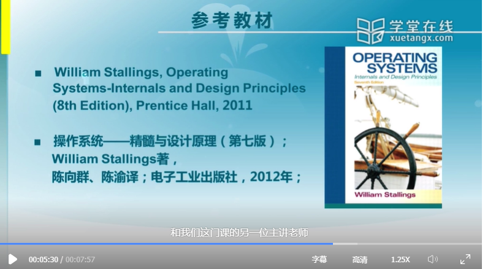

### <u>Linux创始人相关书籍</u>

### <u>教学内容</u>

- #### 操作系统结构

- #### 中断及系统调用

- #### 内存管理

- #### 进程及线程

- #### 处理机调度

- #### 同步互斥

- #### 文件系统

- #### I/O子系统

---

### <u>第一讲、什么是操作系统</u>

- #### 是一个控制程序

  - ##### 一个系统软件

  - ##### 控制程序执行过程，防止错误和计算机的不当使用

  - ##### 执行用户程序，给用户程序提供各种服务

  - ##### 方便用户使用计算机系统

- #### 是一个资源管理器

  - ##### 应用程序与硬件之间的中间层

  - ##### 管理各种计算机软硬件资源

  - ##### 提供访问计算机软硬件资源的高效手段

  - ##### 解决资源访问冲突，确保资源公平使用

---

### <u>第二讲、操作系统的地位</u>

- #### 操作系统软件的分类

  

- #### 操作系统软件的组成

  - ##### Shell —— 命令行接口

    - ##### 通过键盘操纵

    - ##### 方便用户进行命令输入

  - ##### GUI —— 图形用户接口

    - ##### WIMP

    ==（视窗(Window)、图标(Icon)、选单(Menu)、指标(Pointer)）==

    - ##### 直接操作和所见即所得

  - ##### Kernel —— 操作系统的内部

    - ##### 执行各种资源管理等功能

- #### 操作系统与用户关系

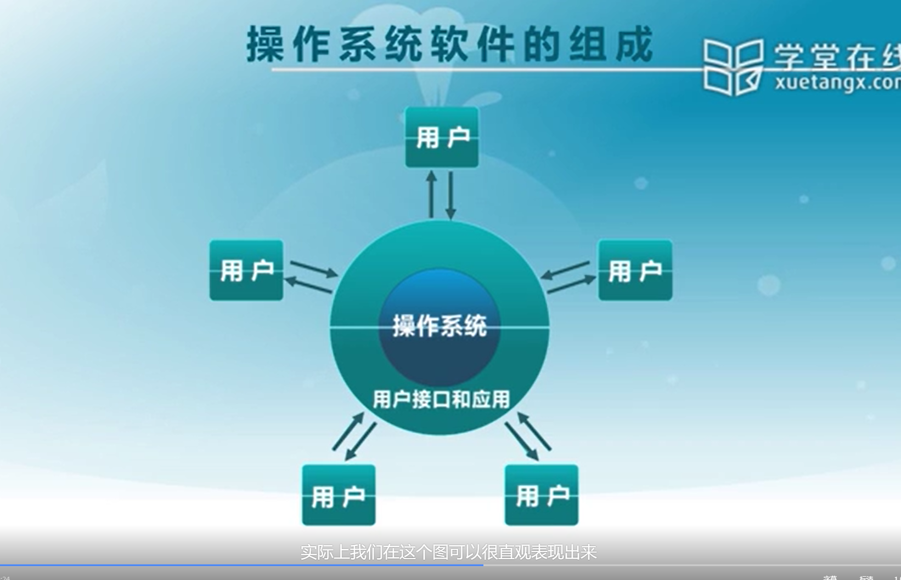

- #### ucore教学操作系统内核

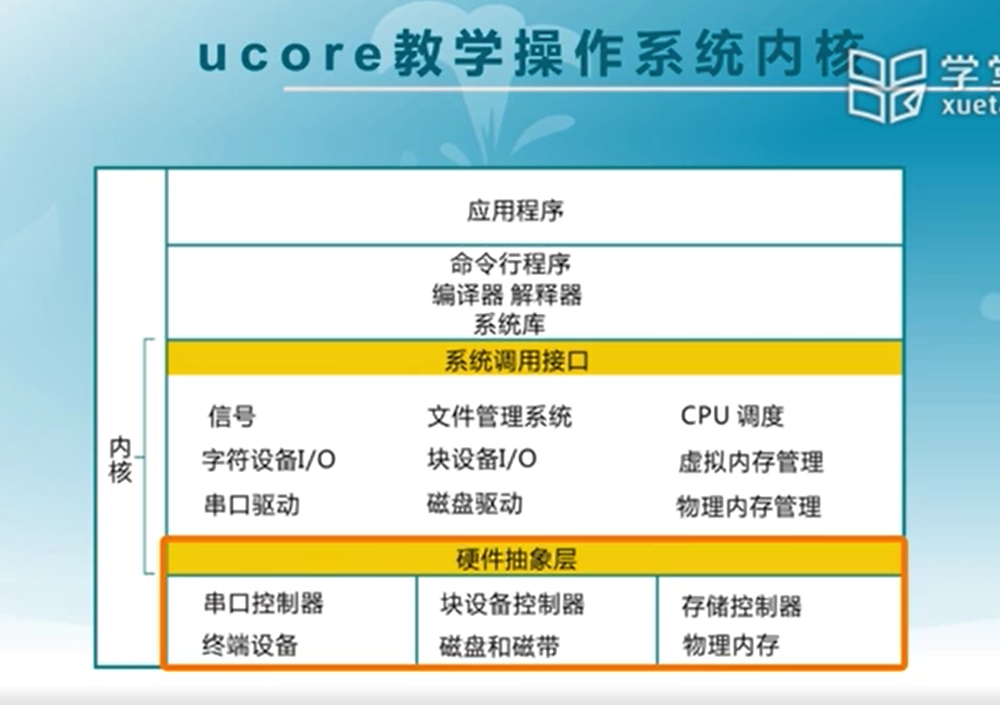

---

### <u>第三讲、操作系统内核特征</u>

- #### 并发：

  - ##### 计算机系统中同时存在多个运行的程序，需要OS管理和调度

- #### 共享：

  - ##### 宏观上，“同时”访问

  - ##### 微观上，互斥共享

- #### 虚拟：

  - ##### 利用多道程序设计技术，让每个用户都觉得有一个计算机专门为他服务

- #### 异步

  - ##### 程序的执行不是一贯到底，而是走走停停，向前推进的速度不可预知

  - ##### 只要运行环境相同，OS需要保证程序运行的结果也要相同

---

### <u>第四讲、操作系统演变</u>

- #### 单用户系统

- #### 批处理系统

- #### 多程序系统

- #### 分时：在执行前一个作业期间会有一个时间中断，在中断时候执行下一个作业，好处是有可能第一个作业执行时间很长，而第二个执行时间很短，这样第二个就可以不用一直等待第一个执行完，在总时间上是延长了，但是对于每个作业调度达到公平

- #### 个人计算机：每个用户一个系统

- #### 分布式计算：每个用户多个系统

---

### <u>第五讲、操作系统结构</u>

- #### 微内核结构

  	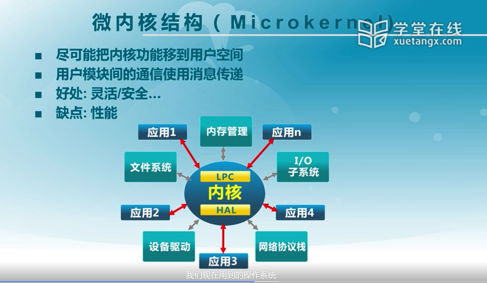

- #### 外核结构

  	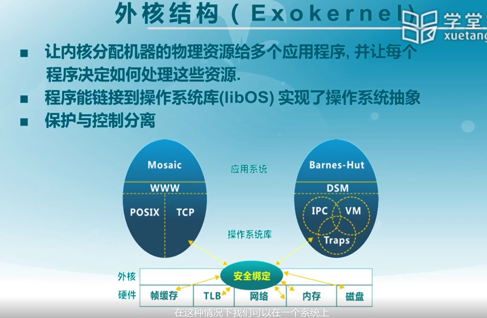

  -  内核只提供硬件和操作系统之间的安全绑定，让每个操作系统决定如何处理和调度资源，这样能够让系统更好的兼容不同操作系统

- #### VMM虚拟机管理器

  

  - 管理器负责资源隔离，操作系统复杂资源管理
  
---

### <u>第六讲、计算机加电之后发生了什么？</u>

 - ### 1. 启动：

   - #### 内存分为`RAM`（随机访问存储）和`ROM`（只读存储），计算机会从只读存储中读取并使用系统的初始化代码（我们上一次使用的记录）

      

   - #### 通电时计算机会从磁盘上读取相关信息（实模式下），而为了访问磁盘设备就需要`BIOS`的一系列服务

      - ##### BIOS不直接读取数据是因为文件系统多种多样BIOS不认识，所以需要磁盘上的加载程序来读取，然后再通过加载程序来读取操作系统，然后读取操作系统内核代码来运行操作系统

      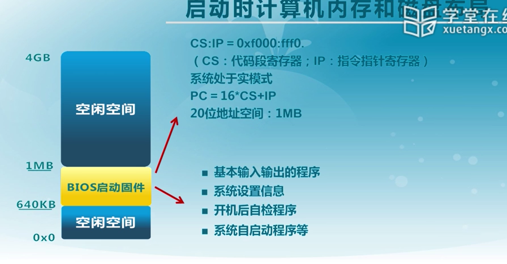

      - ##### BIOS：保存基本输入输出程序、系统配置信息、开机后程序自检程序和系统自启动程序一系列相关信息

         - ##### BIOS以中断调用的方式提供基本输入输出，主要包括：

            - INT 10h：字符显示；
            - INT 13h：磁盘扇区读写；
         	- INT 15h：检测内存大小；
   			- INT 16h：键盘输入
         
      - ##### BIOS只能在`X86`的实模式下工作，如果操作工作在保护模式下BIOS上述的==4==个基本输入输出就不能使用

    - #### 总结：总流程大致为，通电之后读取BIOS，BIOS从磁盘上读取加载程序，加载程序读取操作系统内核代码

      - ##### 计算机启动流程：因为一个计算机有可能有多个计算机系统，也就对应了多个分区，BIOS通过主引导记录找到活动分区，通过活动分区找到对应的系统来启动加载程序，加载对应的操作系统内核，并将操控权给操作系统内核

   	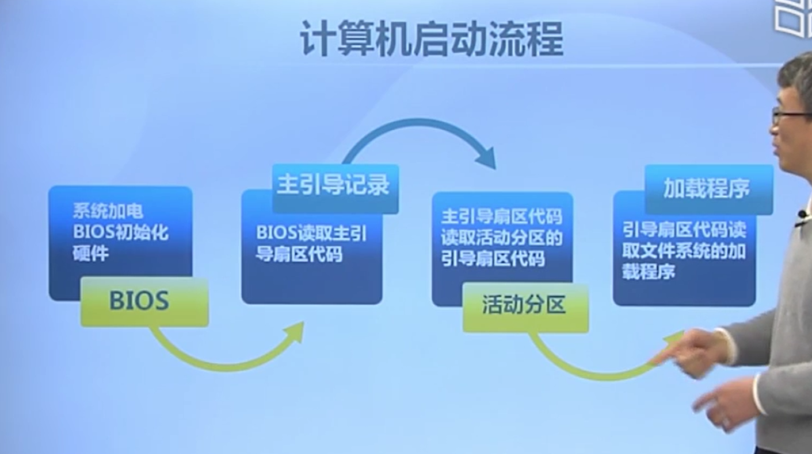

   ​				cpu初始化：

   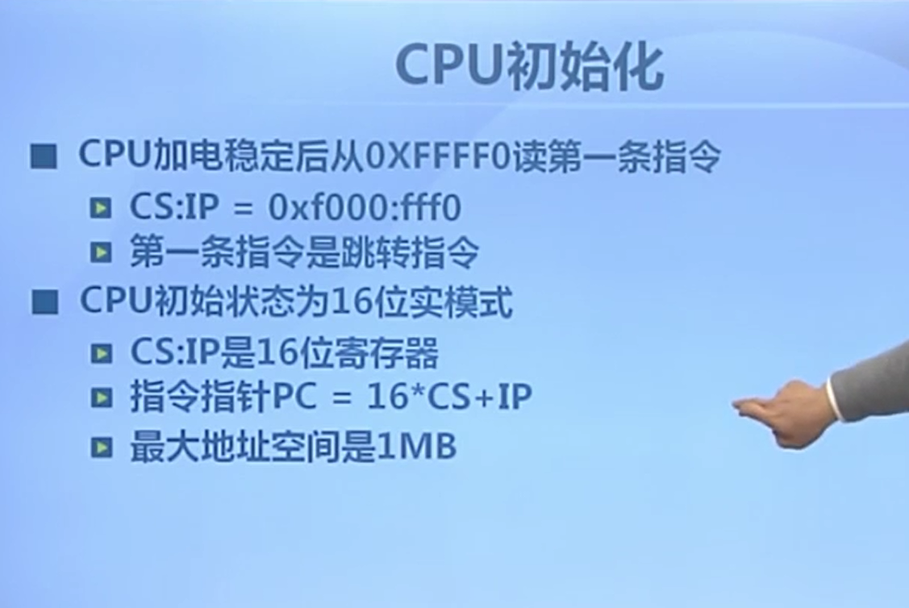

   - #### BIOS初始化过程
     
       - ##### 硬件自检POST
        - ##### 检测系统中内存和显卡等关键部件的存在和工作状态
        - ##### 查找并执行显卡等接口卡`BIOS`，进行设备初始化
        - ##### 执行计算机系统的`BIOS`，并进行系统检测
          
            - ###### 检测和配置系统中安装的即插即用设备
         - ##### 更新`CMOS`中的扩展系统配置数据`ESCD`（主要是将所有硬件设备（也包含即插即用）列一个系统配置表）
         - ##### 按指定启动顺序从软盘、硬盘或光驱启动
       
   - #### 加载程序细化
     
      - ##### 加载程序从文件列表中读取一个启动配置文件（启动配置文件在不同操作机系统间是不同的），根据不同的操作系统（windows、linux等）的启动配置，依据配置加载指定操作系统内核，并将控制权转给操作系统内核
      

      
      
      
      

- ### 2.中断、异常和系统调用：

  - ##### 为什么需要中断、异常和系统调用
  
    - ##### 在计算机运行中，内核是被信任的第三方
  
    - ##### 只有内核可以执行特权指令
  
    - ##### 方便应用程序
  
  - ##### 中断和异常希望解决什么问题
  
    - ##### 当有外设连接计算机的时候，比如==敲击键盘这个时候操作系统应该作出反应，这时候就需要操作系统中断正在进行的任务，去执行键盘任务，这样才能给用户带来良好使用效果==
  
    - ##### 当应用程序处理意想不到的行为时，需要能处理这个异常，比如==当应用程序中一个数除以了一个`0`，操作系统就会告知应用程序异常，应用程序中断并把占用的资源返还给操作系统==
  
  - ##### 系统调用需要解决什么问题
  
    - ##### 系统调用和功能调用~函数库提供的服务~，有什么区别？
  
    - ##### 用户应用程序是如何得到系统服务的？
  
      - ###### 当应用程序使用函数库时，内核、应用程序和函数库会间接的通过系统调用接口使用操作系统内核的服务，比如==要读取一个文件，会通过操作系统的一个磁盘读写`系统调用接口`，通过调用这个接口来通知操作系统读取这个文件内容，操作系统读取后再将内容给应用程序==
  
  - ##### 内核的进入和退出:<!--这个图就是上面中断、异常和系统调用操作的图例-->
  
    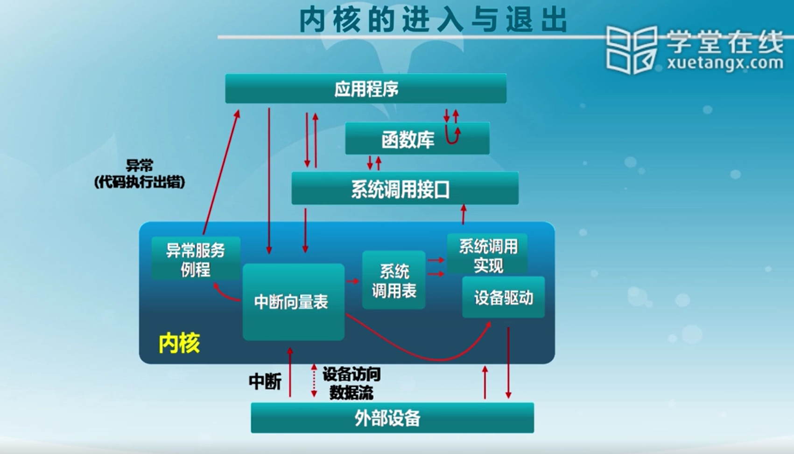
  
    
  
    上图中：中断 -^源头^-> 外部设备，异常 ---> 应用程序意想不到的行为，系统调用 ---> 应用程序请求某些操作所进行的调用
  
    ​				中断 -^响应方式^-> 异步，异常 ---> 同步，系统调用 ---> 异步或同步
  
    ​				中断 -^处理机制^-> 持续，对用户程序是透明的，异常 ---> 杀死或重新执行意想不到的应用程序指令，系统调用 ---> 等待和持续
  
  - ##### 定义
  
    - ##### 系统调用（System Call）：应用程序==主动==向操作系统发出的服务请求
  
    - ##### 异常（Exception）：非法指令或者其他原因导致==当前指令执行失败==*（如：内存出错或者一个数字除以0）*后的处理请求
  
    - ##### 中断（Hardware Interrupt）：来自==硬件设备==*（如键盘）*的处理请求，<!--比如当键盘输入数据时会将数据放在缓存区中，而操作系统看见缓存区有数据，就会中断现在执行的任务，区读取缓存区的数据-->
  
  - ##### 中断处理机制
  
    - ##### 硬件的处理：在cpu初始化时设置中断使能标志，只有==cpu初始化完成==才会处理中断请求，在初始化完成之前cpu时不知道如何处理终端的
  
    - ##### 软件的处理：
  
    	- ###### 现场保存（编译器）
  	
    	- ###### 中断服务处理（服务例程）
    	
    	- ###### 清楚中断标记（服务例程）
    	
    	- ###### 现场恢复（编译器）
    
    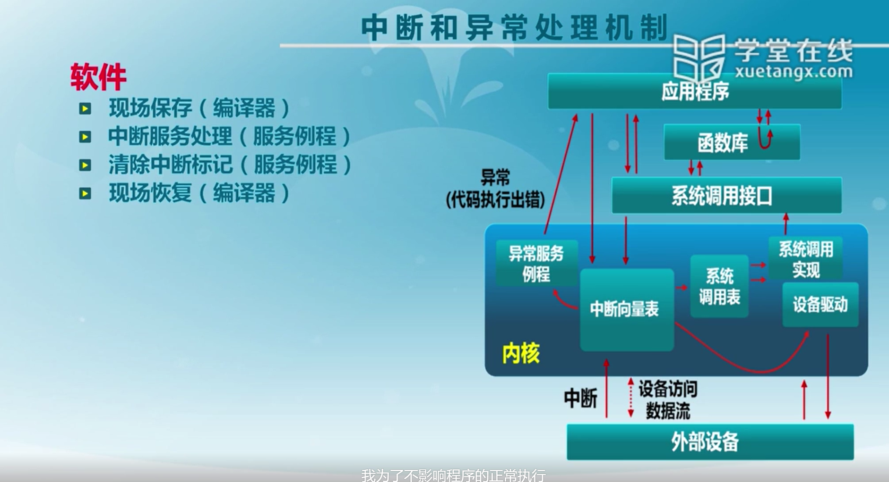
  
  - ##### 中断嵌套
  
    - ##### 硬件中断服务例程可被打断
  
      - ###### 不同硬件中断源头可以在中断处理时出现，比如==在处理一个中断时可以出现另一个中断，操作系统会根据优先级来选择处理哪一个中断，或者交替处理中断==
  
      - ###### 硬件中断服务例程中需要临时禁止中断请求，比如==当电源有问题时，就会禁止其他中断任务，只执行电源相关处理==
  
      - ###### 中断请求会一直保持到cpu做出响应，比如==一个键盘输入中断只有cpu从缓存区取出数据做处理时中断请求才会停止==
  
    - ##### 异常服务例程可被打断
  
      - ###### 异常服务例程执行时可能出现硬件中断，==在执行异常处理时，出现了其他异常导致这个异常被中断==
  
    - ##### 异常服务例程可嵌套
  
      - ###### 异常服务例程可能出现缺页，比如==在执行异常处理时，这个异常处理又出现了异常==
  
  - ##### 中断、异常和系统调用的开销
  
    - ##### 开销超过函数调用
  
    - ##### 中断、异常和系统调用
  
      - ###### 引导机制
  
      - ###### 建立内核堆栈
  
      - ###### 验证参数
  
      - ###### 内核态映射到用户态的地址空间
  
        - 更新页面映射权限
  
      - ###### 内核态独立地址空间
  
        - TLB

---

### <u>第七讲、存储管理（系统中的存储、内存是以==字节==为单位进行访问）</u>

- #### 计算机体系结构

  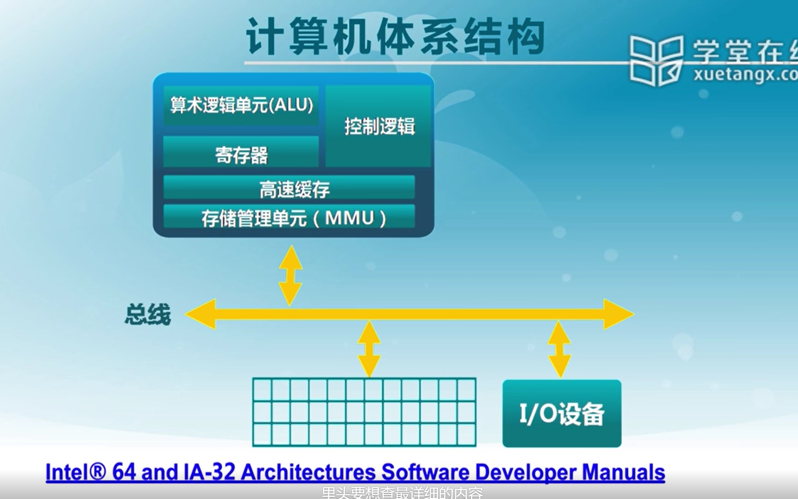

- #### 存储操作

  - ##### cpu存在寄存器一般存数据，但是寄存器很小的（通常32bit或64bit），因此要想读写数据或指令就要从内存中读写，系统是32位就代表一次能从内存中读写`4字节`个数据或指令，如果有的数据或指令经常大量重复利用将这些数据或指令存在cpu的高速缓存中会使读写更快

- #### 内存层次

  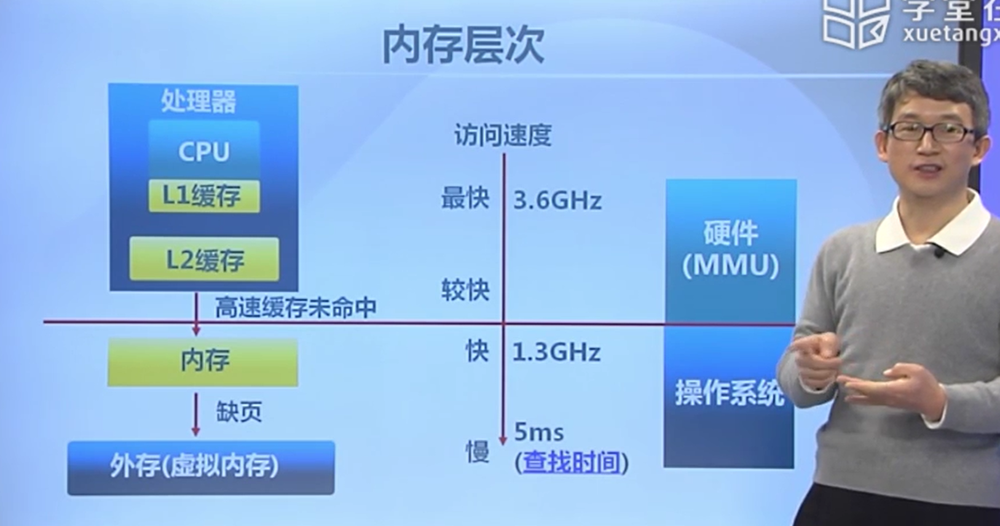

- #### 操作系统内存管理

  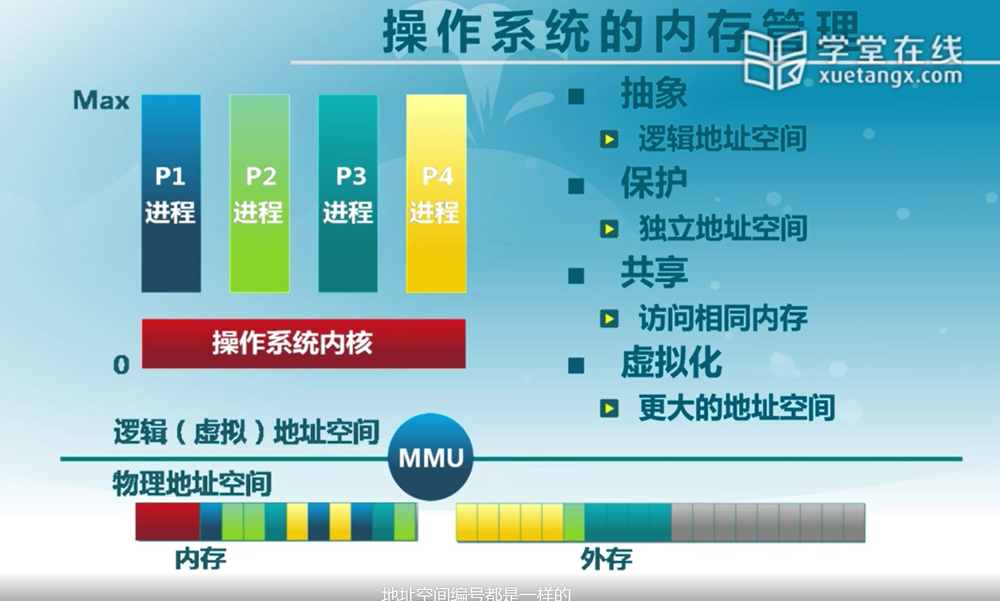
  
  - ##### 操作系统内存管理方式
  
    - ##### 重定位：通过段寄存器的地址进行偏移来寻访正确内存的物理地址
  
    - ##### 分段：将数据，代码和堆栈分成相互独立的三块
  
    - ##### 分页：将内存分成最基本单位（选择一个合适的大小，用字节做单位粒度太细不好管理）
  
    - ##### 虚拟存储
  
      - ###### 目前多数系统（如 Linux）采用按需式虚拟存储
  
    以上管理高度依赖硬件：**1.**与计算机存储架构紧耦合。 **2.**MMU（内存管理单元）：处理CPU存储访问请求的硬件
  
- #### 物理地址&逻辑地址

  - ##### 物理地址空间 —— 硬件支持的地址空间

    - ##### 起始地址0，直到MAX~sys~

  - ##### 逻辑地址空间 —— 在CPU运行的进程看到的地址

    - ##### 起始地址0，直到MAX~prog~

    - ##### 逻辑地址的生成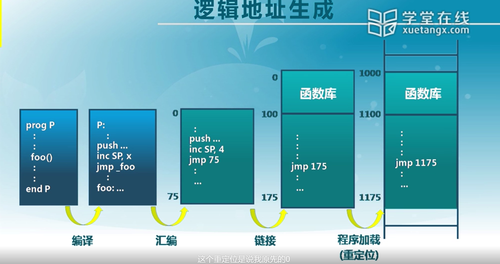

  - ##### 地址的生成时机和限制

    - ##### 编译时：在初始化时就将每个程序的物理地址分配好了（类似于以前的功能手机，不能自己往手机里面下载软件）

      - ###### 假设初始地址已知

      - ###### 如果初始地址改变需要重新编译

      - ###### 在物理内存上的存储时连续的

    - ##### 加载时：在编译阶段用逻辑地址来存储，在程序加载时通过偏移将逻辑地址放到物理地址中（类似于智能手机，可以自己下载程序）

      - ###### 如编译时初始地址未知，编译器需生成可重定向的代码

      - ###### 加载时，生成绝对地址

      - ###### 在物理内存上的存储时连续的

    - ##### 执行时：特定指令会映射某一个区域，将这个区域存到物理内存中，在执行到特定指令时候通过映射寻访物理内存，这样即使这个区域在物理内存中的位置改变了，也能正确找到自己存储的资源（一般用于虚拟存储的系统中）

      - ###### 执行时代码可移动

      - ###### 需地址转换（映射硬件支持）

  - ##### 地址的生成过程：在一段代码执行时`CPU`先看到一段逻辑地址，然后通过`MMU`将逻辑地址转换成物理地址，`CPU`中的控制器再将物理地址和相关的总线控制信号送到总线上，存储单元（存储芯片）会识别总线上的物理地址和总线控制信号（==读操作==或==写操作==），对内存相应地址进行读或者写。

    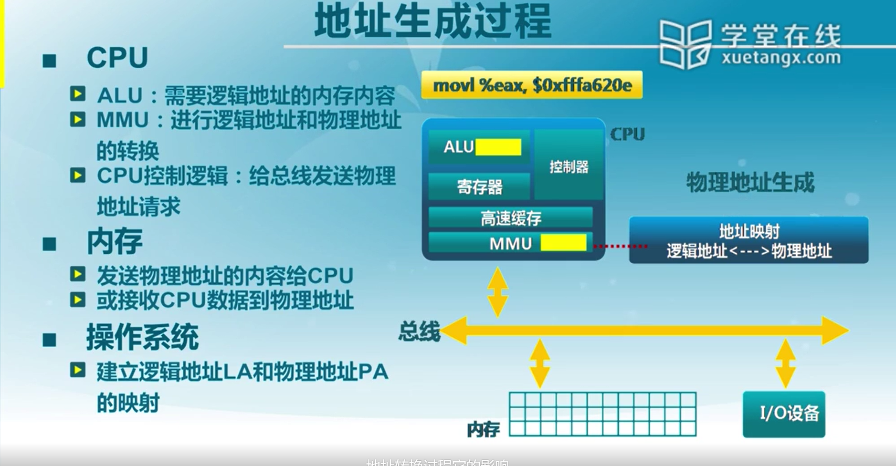

  - ##### 地址检查：`CPU`在生成逻辑地址时会先检查偏移量是不是在段长度（0到MAX~prog~）之内，如果正确，段长度再加上段基址（基础地址），总和最后到物理地址中。==段长度和段基址都是操作系统设置的==

    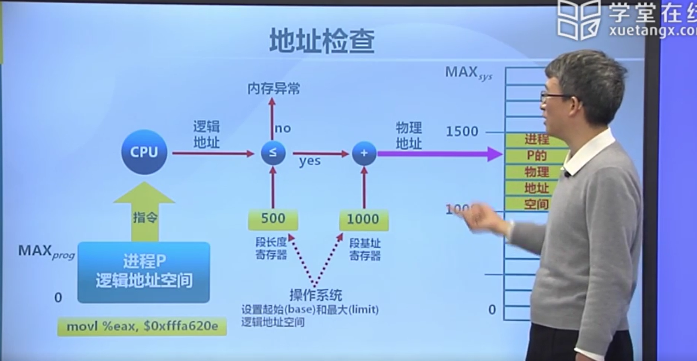

- #### 连续内存分配

  ##### ==已分配的分区列表：将所有已分配的分区的信息*（分区大小、物理地址等）*存放在操作系统维护的数据结构中==

  ##### ==空闲分区列表：将所有空闲分区的信息*（分区大小、物理地址等）*存放在操作系统维护的数据结构中==

  - ##### 连续内存分配和内存碎片

    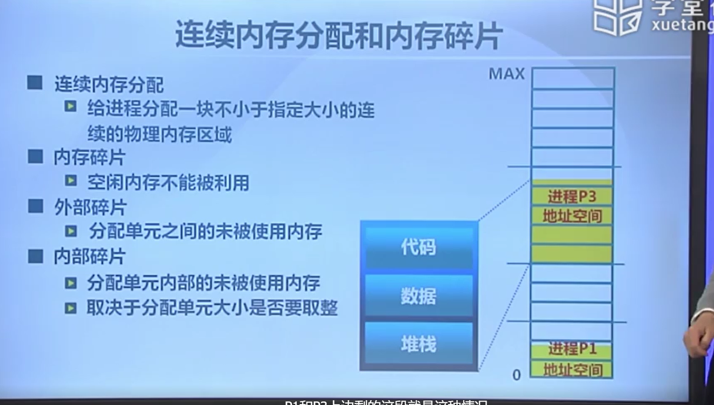

    - ##### 连续内存分配：给进程分配一块不小于指定大小的连续的物理内存区域

    - ##### 内存碎片：空闲内存不能被利用

      - ###### 外部碎片：两个进程之间的进程被释放，所释放的内存过小，其他进程都不能利用这部分进程

      - ###### 内部碎片：分配给进程内部的一些无法利用的区域，分配单元要取整所导致的，比如==（一个进程需要510`byte`空间，但是分配字节只能分配2的整数幂所以会分配512`byte`，余下的2`byte`无法被利用）==

  - ##### 连续内存分配：动态分区分配

    - ##### 动态分区分配：当程序被加载执行时，分配一个进程指定大小可变的分区（块、内存块），分区的地址时连续的

    - ##### 操作系统需要维护的数据结构（哪些分区空闲哪些分区被分配）

      - ###### 所有进程已分配的分区

      - ###### 空闲分区

    - ##### 动态分区分配策略（为了找分区）

      - ###### 最先匹配（First fit）：内存从前到后找到哪个分区合适就用哪个分区

        - 原理&实现：
          1. 空闲分区按照地址顺序进行排序
          2. 分配过程时，搜索一个合适的分区
          3. 释放分区时，检查相邻是否由空闲分区，与相邻的空闲分区合并
        - 优点：
          1. 简单
          2. 在高地址空间有大块的空闲分区
        - 缺点：
          1. 外部碎片
          2. 分配大块时较慢

      - ###### 最佳匹配（Best fit）：将所有内存分区都遍历一遍，找到比需要内存长度大的最少的分区

        - 原理&实现
          1. 空闲分区列表按照==由小到大==进行排序
          2. 分配时，查找一个合适的分区
          3. 释放时，查找并合并==地址临近==的分区，因为空闲分区列表时按照大小进行排序，但是释放时找临近分区还是要找==地址临近==的分区
        - 优点：
          1. 避免大的分区被拆分
          2. 可以减小外部碎片的大小
          3. 相对简单
        - 缺点
          1. 外部碎片过小难以被利用
          2. 释放分区缓慢
          3. 容易产生过多的无用小内存碎片

      - ###### 最差匹配（Worst fit）：找内存中剩余的内存分区最大的那个

        - 原理&实现：
          1. 空闲分区列表按照==由大到小==进行排序
          2. 分配时，选最大分区
          3. 释放时，找==地址临近==的分区合并，并将合并后的分区放在分区列表中，并将列表排序
        - 优点：
          1. 中等大小的分配较多时，效果最好
          2. 避免了过多的小碎片
        - 缺点：
          1. 释放分区缓慢
          2. 外部碎片
          3. 容易破坏大的分区，导致难以找到可分配的大分区

  - ##### 碎片整理：通过调整进程占用的分区位置来减少或避免分区碎片

    - ##### ##### 碎片紧凑：通过移动分配给进程的内存分区，以合并外部碎片

      - ###### 条件：

        - ###### 所有的应用程序可动态重定位

        - 只有处于等待状态的进程才可以移动，正在执行的进程不去移动

        - 开销：是否有必要进行紧凑，不要为了一小块区域去移动

    - ##### 分区对换（Swappi in/out）：通过抢占并回收处于等待状态进程的分区，将等待状态进程占用的相关资源存储到外存，以增大内存可用空间，==早期的多进程就是通过对换分区方式来实现的，主要是进程间在内存上的交替运行==

  - #### 伙伴系统（Buddy System）：

    - ##### 内存分配：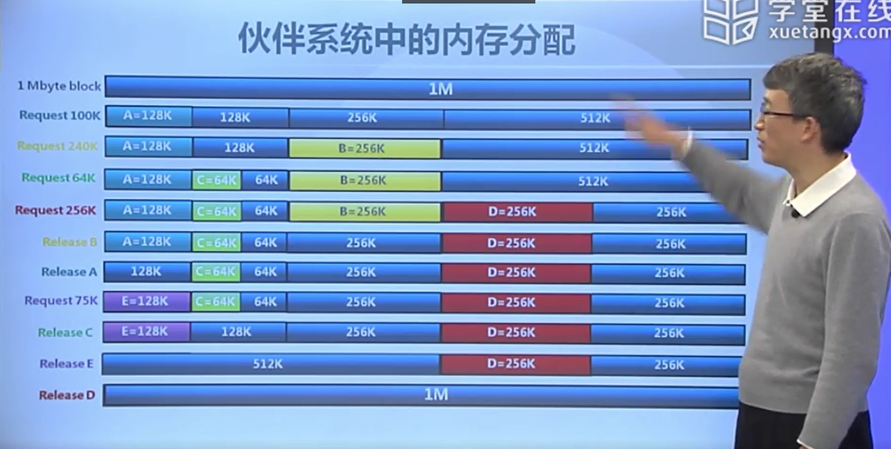

    - ##### 释放和合并：

- #### 非连续内存分配

  - ##### 连续分配的缺点

    - ##### 分配给程序的物理内存必须连续

    - ##### 存在内碎片和外碎片

    - ##### 内存分配的动态修改困难

    - ##### 内存利用率低

  - ##### 非连续内存分配要达到的目标：提高内存利用率和管理灵活性

    - ###### 允许一个程序的使用非连续的物理地址空间

    - ###### 允许共享代码与数据（因为每个进程之间会有共同的代码和数据，我们希望这个公共部分可以共用）

    - ###### 支持动态加载和动态链接

  - ##### 需要解决的问题

    - ##### 如何实现虚拟地址到物理地址的转换？

      - ###### 软件实现（灵活，开销大）

      - ###### 硬件实现（够用，开销小）

  - ##### 非连续内存分配的硬件辅助机制

    - ##### 如何选择非连续内存分配中的内存分块大小

      - ###### ==<u>段式存储管理（segmentation）</u>==—— 分块较大，以==段==作为基本单位

      - ###### ==<u>页式存储管理（paging）</u>== ——分块较小，以==页==作为基本单位

  - ##### <u>==段式存储管理==</u>

    - ##### 段地址空间：进程中的段地址空间由多个段组成

      - ###### 主代码段

      - ###### 子模块代码段

      - ###### 共用库代码段

      - ###### 堆栈段（stack）

      - ###### 堆数据（heap）

      - ###### 初始化数据段

      - ###### 符号表等

    - ##### 段式存储管理目的

      - ###### 更细粒度和灵活的分离与共享

    - ##### 段式存储管理不连续二维结构

      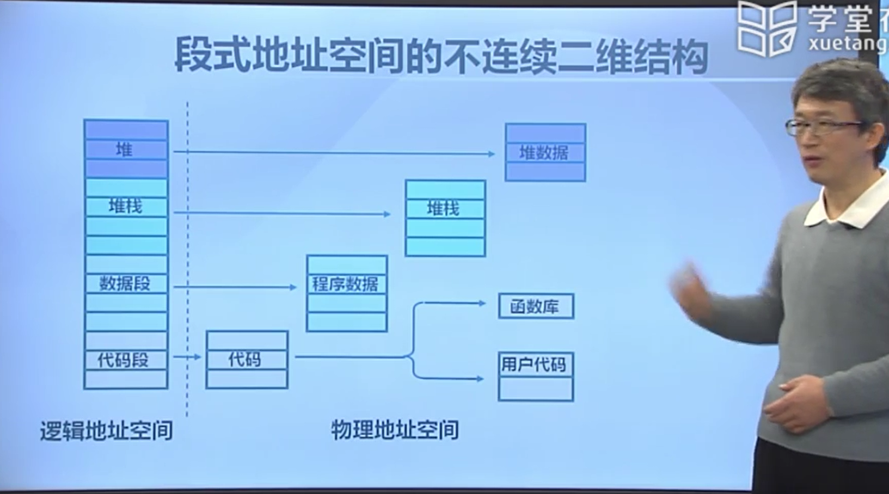

    - ##### 段地址空间逻辑视图

      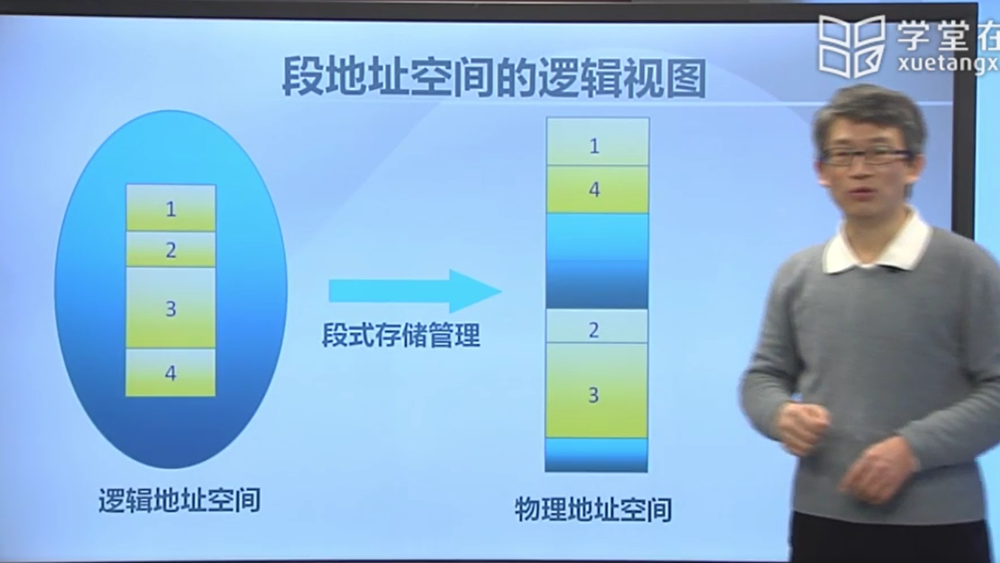

     - ##### ==段的概念：段表示访问方式和存储数据等属性相同的一段地址空间==

         - ###### 每一个段对应一个连续的内存“==块==”

         - ###### 若干个段组成进程逻辑地址空间

    - ##### 段访问：逻辑地址由二元组（s，addr）表示

      - ###### s —— 段号

      - ###### addr —— 段内偏移

    - ##### 段访问机制

      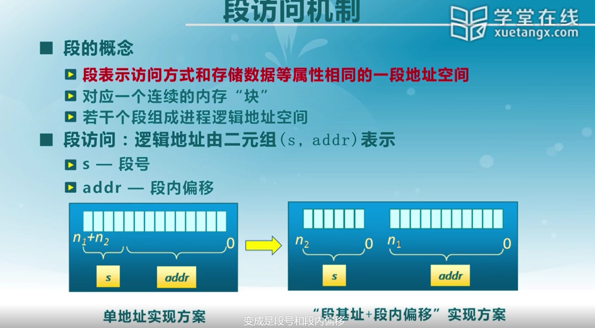
    
    - ##### 段访问硬件实现

      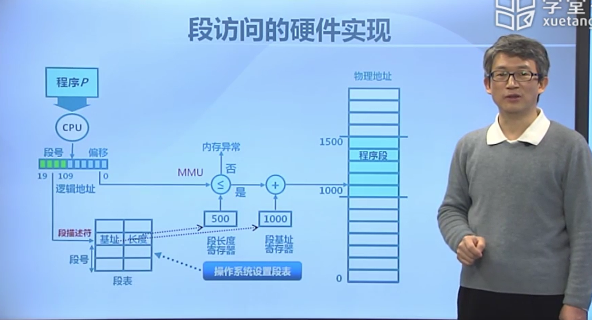

  - ##### <u>==页式存储管理==</u>

    - ##### 物理地址单位：页帧（帧、物理页面、Frame、Page Frame）

      - ###### 把物理地址空间划分为大小相同的基本分配单位（2的n次幂，如512，256）

      - ###### ==帧号不连续==

      - ###### 内存物理地址的表示：二元组（f，s）

        - f —— 帧号（==不连续的==，F位，共有2^F^个帧）
        - o —— 帧内偏移（s位，每帧有2^s^字节）
        - 物理地址 = $f*2^s+o$

      - ###### 基于页帧物理地址计算实例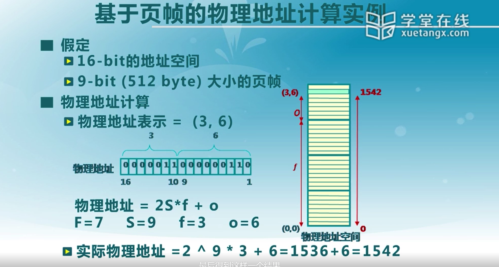

    - ##### 逻辑地址单位：页面（页、逻辑页面、Page）

      - ###### 把逻辑地址空间划分为大小相同的基本分配单位

      - ###### ==页号是连续的==

      - ###### 帧和页的大小必须相同

      - ###### 进程逻辑地址的表示：二元组（p，o）

        - p —— 页号（==连续的==，P位，2^P^个页）
        - o —— 页内偏移（S位，每页有2^S^个字节）
        - 虚拟地址 = $p*2^s+o$
        - 页内偏移 = 帧内偏移
        - 通常：页号大小 ≠ 页帧大小

    - ##### 页面到页帧之间的转换

      - ###### 逻辑地址到物理地址的转换

        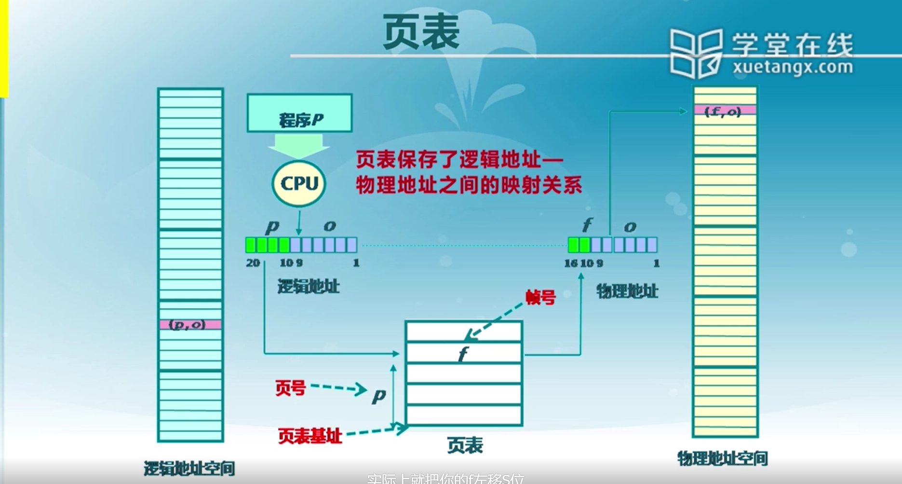

        - 页表（因为页号是连续的，而页帧不连续，所以需要页表来将逻辑地址和物理地址对应起来）
        - MMU（存储管理单元）/TLB（转译后备缓冲区又称快表）

  - ##### 页表

    - ##### 概述：从逻辑页号到物理帧号的转换

    - ##### 每个进程都有一个页表

      - ###### 每个页面对应一个页表项

      - ###### 随着进程运行状态而动态变化

      - ###### 页表基址寄存器

    - ##### 结构：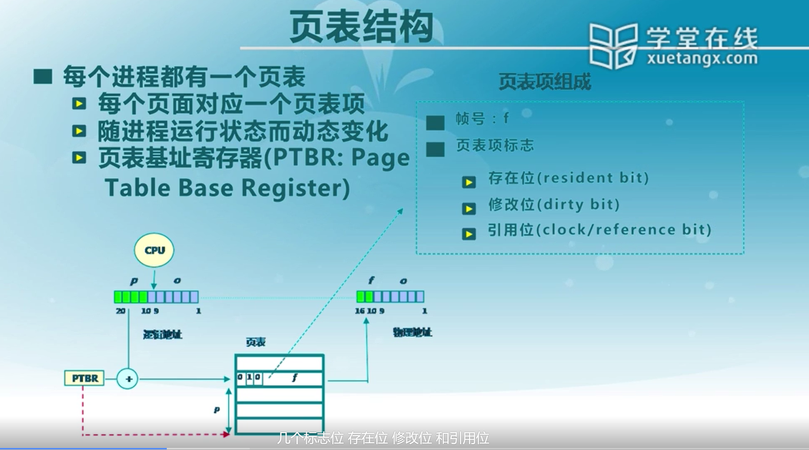

    - ##### 页面地址转换实例：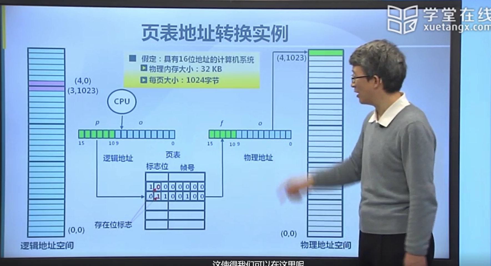

    - ##### 性能问题以及解决方法：

      - ###### 缓存（==CPU中==的快表）：一般相邻的指令访问相同页面的可能性比较大，所以将当次的页表内容缓存到==CPU中==的快表中，下一次就不用再去查询页表了

        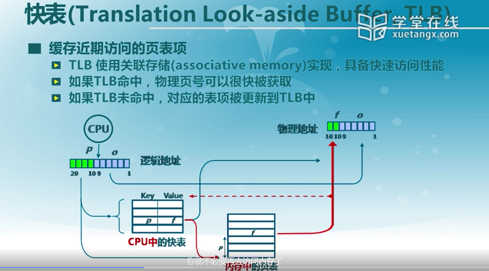

      - ###### 间接访问（多级页表）：通过多级引用将页号分成若干级（类似于查字典）

        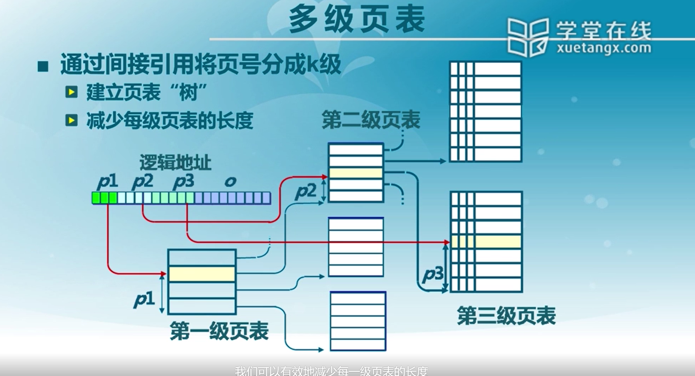

        - 二级页表实例：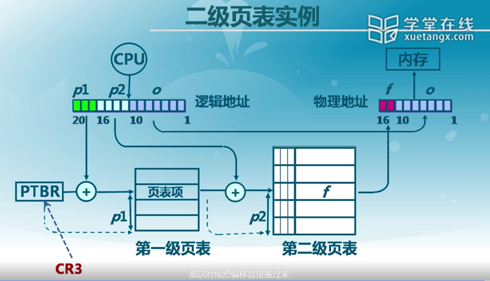

      - ###### 反置页表：让页表项和==物理地址空间==大小相对应，而不是==逻辑地址空间==大小相对应

        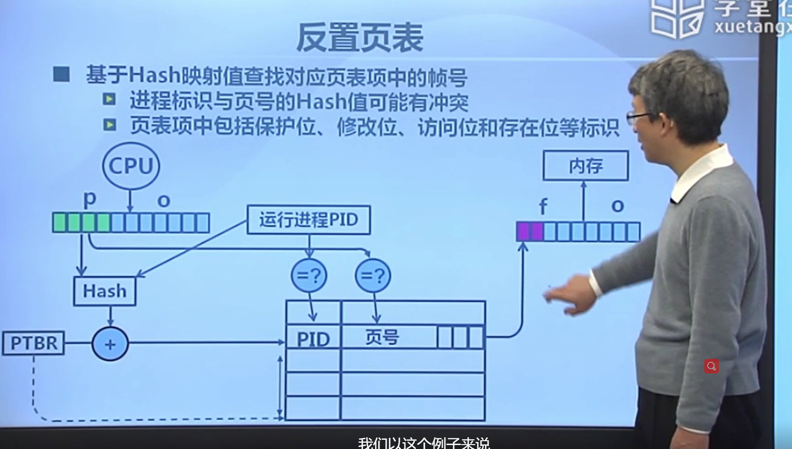

        - 反置页表的Hash冲突：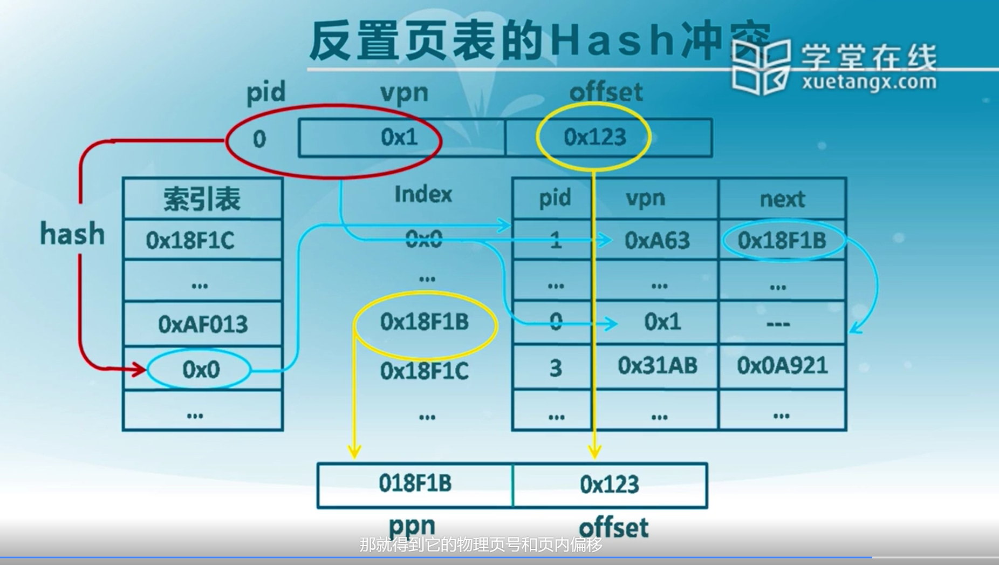
      
  - ###### 页寄存器（Page Registers）：
      
    - 每一个帧与一个页寄存器关联，寄存器内容包括：
             - 使用位（Residence bit）：此帧是否被进程占用

             - 占用页号（Occupier）：对应的页号p

             - 保护位（Protection bits）
       - 优点：
    
          - 页表大小相对于物理内存而言很小
            - 页表大小与逻辑地址空间大小无关
         - 缺点
           - 页表信息对调后，需要依据帧号可找页号
             - 在页寄存器中搜索逻辑地址中的页号
        - 页寄存器地址转换：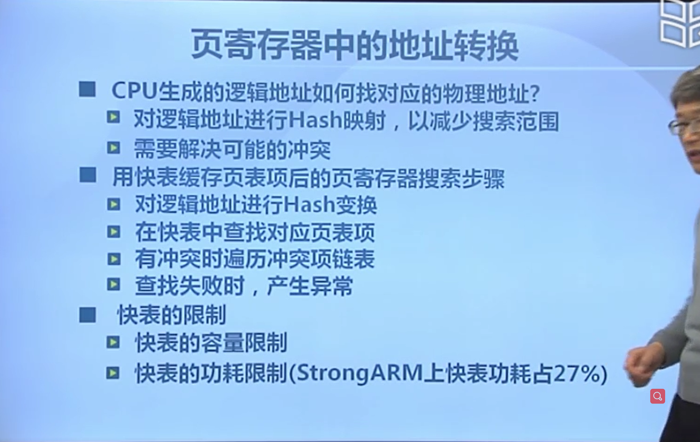
    
  - ##### 段页式存储管理：在段式存储管理的基础上，给每一个段加一级页表

    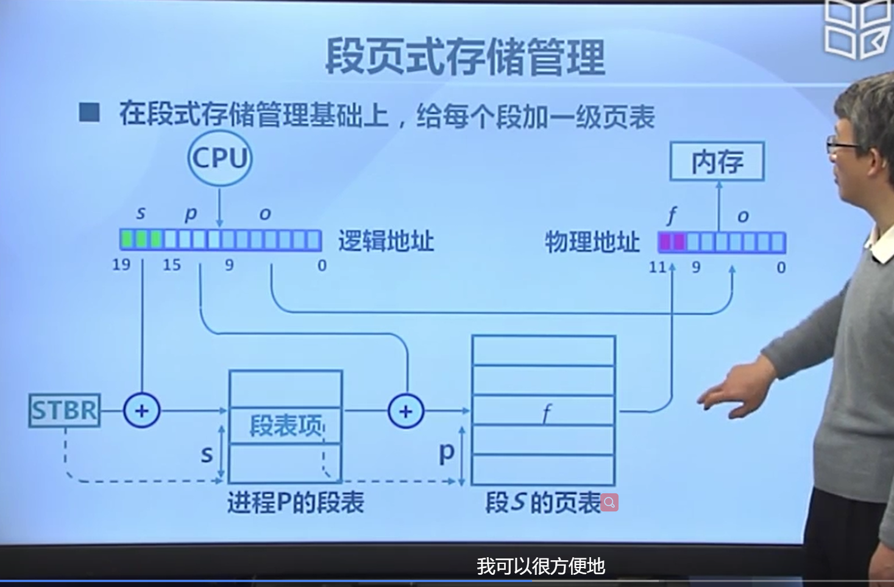

    - ##### 段式存储中的内存共享：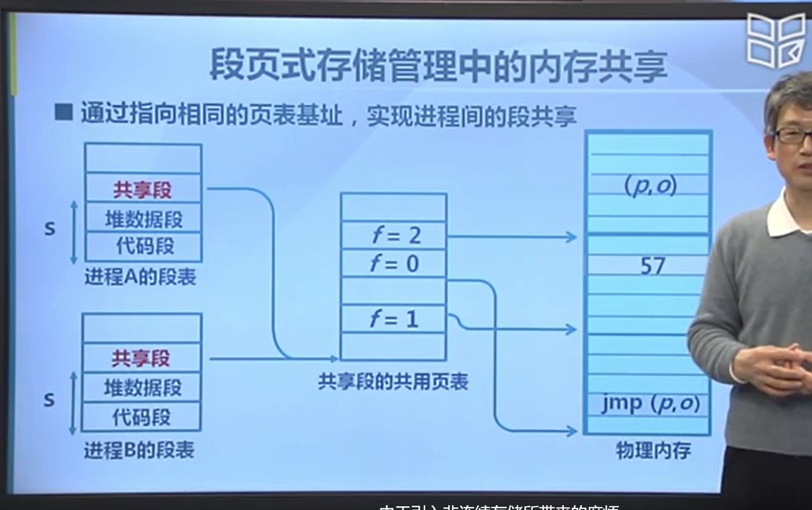

### 	<u>第八讲、虚拟存储</u>

- #### 为什么要用虚拟存储：现如今人们对于应用的要求越来越高，对于游戏的画面互动要求页越来越高，导致对于内存大小的依赖增强

- #### 虚拟存储概念

  - ##### 理想中的存储器：容量更大、速度更快、价格更便宜的非易失性存储器

  - ##### 实际中的存储器：存储器层次结构由上到下速度依次减慢

    - ##### CPU寄存器 —— ==速度：==1纳秒 —— ==容量：==<1KB

    - ##### CPU高速缓存 —— 2纳秒 —— 1MB

    - ##### 内存 —— 10纳秒 —— 64-512MB

    - ##### 磁盘 —— 10毫秒 —— 5-50GB

    - ##### 磁带 —— 100秒 —— 20-100GB

  - ##### 操作系统的存储抽象

    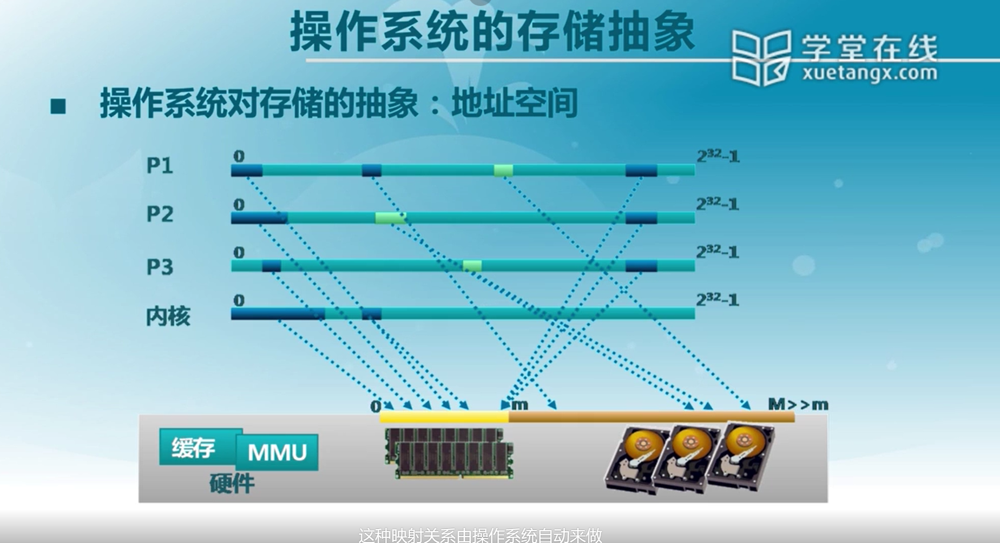

  - ##### 虚拟存储的需求

    - ##### 计算机系统时常出现==内存空间不够用==

      - ###### 解决方法：

        1. 覆盖（overlay）：应用程序==手动==把需要的指令和数据保存到==内存==中
        2. 交换（swapping）：操作系统==自动==把暂时不能执行的程序保存到==外存==中
        3. 虚拟存储：在有限容量的内存中，以页位单位==自动==装入==更多更大==的程序