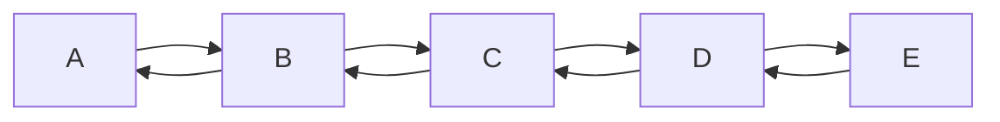
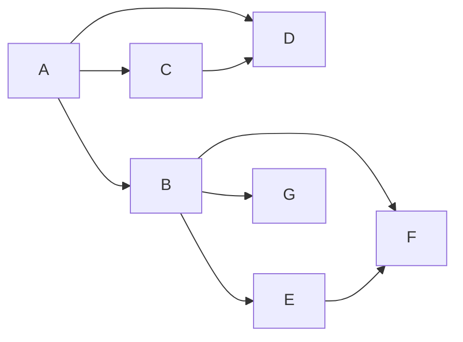

##### 											     数据结构与算法

------

#### 一维数据结构（线性数据结构）：①.数组，②.链表，③.双链表，④.栈，⑤.队列

##### 1.数组：[1,2,3,4]

（1）特性：3个

- 数组定长（数组长度不可变）：js中js引擎会帮我们扩容，扩容是消耗性能的，耗费cpu 

  （扩容是指将原来的数组复制到一个新的数组中------eg:比如一个长为8的数组存第9个的时候会将数组复制放在一个更大的数组中然后再新的数组中存第9个数，原来的那个数组就不用了）

  （申请存储空间是操作系统来给你分配的，操作系统一次只能给你一组连续的存储结构）

  ###### ==(最好在声明数组是将长度定义好)==

- 存储在物理空间上是连续的。

- 数组的变量指向的是数组的第一个元素的起点；

  eg:`var arr = [5，6，7，8]` arr就是这个数组的起点也代表这个数组；
  
  > ##### 数组存储方式：如下(数组的~变量（arr）~就相当于下图中5左边的~那个线（也就是指起点）~)

  >           | 5    | 6    | 7    | 8    | 9    |
  >           | ---- | ---- | ---- | ---- | ---- |
  >           |      |      |      |      |      |


  > ###### ==arr[1],arr[2]：这个~方括号("[]")~表示存储地址的偏移([1]表示偏移一位)==
  >
  > > ###### ==操作系统中通过偏移~访问（查询）~数据性能最好==

  

（2）优点：1个

- 查询性能最好（指定查询某个位置）

（3）缺点：

-  因为空间必须是连续的 ，所以如果数组比较大，当系统的空间碎片较多时容易存不下

  （如果空间碎片较多时为了能存下你的这个数组会让操作系统对你的这个存储空间进行整理，整理速度非常慢 ）

-  因为数组的长度是固定的，所以数组难以被添加和删除（删除时会将后面的数据往前移动）。

##### 2.链表(单链表): 1 --> 2 -- > 3 --> 4

(1)特性：
- 有两个部分：数据域和指针域\
（数据域存数据,指针与存下一个数据的引用，用来寻找下一个数据，实现连续的存储结构）

```
 var b = {
     value: 2,
     newxt: null;   
 }
 var a = {
     value: 1,
     next: b
 }
 <!--不能说b在a的里面只能说a的指针指向b-->
```
- 在空间上不是连续的
- 每存一个值都需要多存一个指针

- 想传递一个链表，必须传递链表的根节点（因为如果不传递根节点没有一个指针是指向根节点的，所以要获取根节点的值是获取不到的）

- 双链表的所有东西都可以用单链表来实现，所以最好不用双链表

- ###### ==每一个节点，都认为自己是根节点（因为每一个节点只记录自己和下面的节点，并不知道谁指向了自己）==

(2)优点：2个
- 只要空间够大就能存下，不用担心空间碎片问题
- 添加或删除方便只需改变指针域的指向就可以

 （eg：如果在3和4中间插入一个6只需要将3的指针指向6将6的指针指向4就可以了，删除就是将3的指针直接指向4就可以删除6了，并不需要断开6指向4的连接）

 ###### ==1 --> 2 --> 3 --> 4 (删除3后变为1 --> 2 -->   4并且3 --> 4,原来那个以1为根节点的链表没有3了)==

> #### `删除操作` 
> ```mermaid
> graph LR
> A-->B
> B-->C
> C-->D
> D-->E
> ```
> ###### `上面的链表删除C后数据的结构变为:`
>
> ```mermaid
> graph LR
> A-->B
> B-->D
> D-->E
> C-->D
> ```

(3)缺点：

- 查询速度慢（每次查询都需要从根节点找指针域指向的下一个节点，来找对应节点的数据域，不能像数组那样通过偏移来查找）
- 链表的每一个节点都需要创建两个存储空间（数据域和指针域），浪费空间（==数据存的越多这个指针域相对来说==，==浪费的空间对于使用方面来说==，==浪费的就越少==，因为如果要存一个数就相当于用了两倍的空间来存这个数，还有一个就是指针的空间，但如果要存100个数，就相当于只比原来多了1/101个空间内存）。

\
####  ==*== 线性数据结构的遍历
>######  遍历：将一个集合中的每一个元素进行获取并查看.
>> ##### ==算法题如果没把报错条件做处理一分没有==

>> ###### 数组的遍历：{循环遍历，递归遍历}
```
<!--数组的循环遍历-->
var arr = [2,3,4,5,6,7];
function each(arr) {
    if (arr === null) return;<!--算法题必须加上这个判断，如果arr不为空那样调用它的length属性时会报错，算法题报错的条件没有做处理一分不给-->
    for (var i = 0; i < arr.length; i++) {
        console.log(arr[i])
    }
}
```

```
<!--数组的递归遍历-->
function each(arr, i) {
    if (arr === null) return;
    if (arr.length === i + 1) {
        console.log(arr[i]);
        return;
    }
    console.log(arr[i]);
    each(arr, i + 1)
}
<!--或者-->
function each(arr, i) {
    if (arr === null || arr.length <= i) return;
    console.log(arr[i]);
    each(arr, i + 1)
}
```

>> ###### 链表的遍历：{循环遍历，递归遍历}
```
<!--链表的循环遍历-->
function Node(value) {
    this.value = value;
    this.next = null;
}
var node1 = new Node(1);
var node2 = new Node(2);
var node3 = new Node(3);
var node4 = new Node(4);
var node5 = new Node(5);
node1.next = node2;
node2.next = node3;
...
function each(root) {
    var tem = root;
    while(true) {
        if(tem !== null) {
            console.log(tem.value); 
        } else {
            break;
        }
        tem = tem.next;
    }
}

```
```
<!--链表的递归遍历-->
    funciton each(root) {
        if (root === null) return;
        console.log(root.value);
        each(root.next);
    }
```
#### ==*== 链表的逆置
>> ##### ==1 --> 2 --> 3 --> 4== 变为 ==4 --> 3 --> 2 --> 1==

```
<!--链表的逆置-->
function Node(value) {
 this.value = value;
 this.next = null;
};

var node1 = new Node(1);
var node2 = new Node(2);
var node3 = new Node(3);
var node4 = new Node(4);
var node5 = new Node(5);
node1.next = node2;
node2.next = node3;
...
function reverse(root) {
    if (root.next.next === null) {
        root.next.next = root;
        return root.next
    } else {
        var result = reverse(root.next);
        root.next.next = root;
        root.next = null;
        return result
    }
}
```
#### ==*== 数组的排序   ==~没有弄明白~==
```
 <!--标准的快排（不创建其他数组，只在原数组上做操作）-->
 function quickSort1(arr, start, end) {
    if (arr === null) return [];
    if (start >= end - 1) return arr;
    var left = start;
    var right = end;
    do {
      do left++;
      while (left < right && arr[left] < arr[start]);
      do right--;
      while (left < right && arr[right] > arr[start]);
      if (left < right) {
        var tem = arr[left];
        arr[left] = arr[right];
        arr[right] = tem;
      }
    } while (left < right);

    var point = left === right ? right - 1 : right;
    tem = arr[point];
    arr[point] = arr[start];
    arr[start] = tem;
    quickSort1(arr, start, point);
    quickSort1(arr, point + 1, end);
 }
```
#####  3.双链表(一般没有什么算法)




  （1）特性：两端都可以为首两端也都可以为尾

  （2）优点：无论给出哪一个节点，都可以对整个连标进行遍历
  （3）缺点：多耗费引用空间，构造较复杂
  ```
  <!--创建双向链表-->
     function Node(value) {
         this.value = value;
         this.next = null;
         this.pre = null;
     };
     
     var node1 = new Node(1);
     var node2 = new Node(2);
     var node3 = new Node(3);
     var node4 = new Node(4);
     var node5 = new Node(5);
     
     node1.next = node2;
     node2.pre = node1;
     node2.next = node3;
     node3.pre = node2;
     node3.next = node4;
     node4.pre = node3;
     node4.next = node5;
     node5.pre = node4;
  ```


##### 4.栈（first in last out）

##### 5.队列（first in first out）

---

#### 二维数据结构（平面数据结构）：①.二维数组，②.二维拓补结构~（图）~③树~（树是图的一种）（树的学名叫~==*~有向无环图~*==~）~

##### 1.二维数组：[[1, 2, 3], [9, 8, 7], [7 ,4, 1], [5, 6, 7]]*==~(一个4行3列的二维数组)~==*

| 1    | 2    | 3    |
| ---- | ---- | ---- |
| 4    | 5    | 6    |
| 7    | 8    | 9    |
| 10   | 11   | 12   |


##### 2.二维拓补结构（图：~指的是离散数学中的图~）：相当于由多个链表组成
> ##### 拓补学：只研究两者之间的关系（只要关系相等就称为相等~*eg:a与b是朋友即使a与b变远了，a与b仍然是朋友~）



```
 <!--根据上面结构：图的构建-->
 function Node(value) {
     this.value = value;
     this.neighbor = [];
 }
 
 var a = new Node('a');
 var b = new Node('b');
 var c = new Node('c');
 var d = new Node('d');
 var e = new Node('e');
 var f = new Node('f');
 var g = new Node('g');
 
 a.neighbor.push(b);
 a.neighbor.push(c);
 a.neighbor.push(d);
 b.neighbor.push(a);
 b.neighbor.push(e);
 b.neighbor.push(f);
 b.neighbor.push(g);
 c.neighbor.push(a);
 c.neighbor.push(d);
 d.neighbot.push(a);
 d.neighbor.push(c);
 e.neighbor.push(b);
 e.neighbor.push(f);
 f.neighbor.push(b);
 f.neighbor.push(e);
 g.neighbor.push(b);
 
```


##### 3.树：图的一种，学名为 *~有向无环图~* 

>> ##### 树 ~：包含{二叉树，b树，红黑树等}~

 （1）特性：

 - 树不能有回路，结构不能成环，必须要有~方向(只能由根节点或者父节点指向子节点)~
 - 每一个节点都认为自己是根节点

```markdown
                          A
             (B           C          D)   
        (E    F    G)  (H    I)     (J)
     (K   L)
```


 （2）相关名词：

 - 根节点：A
 - 父节点：上级节点（现对某一节点来说）
 - 子节点：下级节点（相对某一节点来说）
 - 叶子结点：没有其他子节点的节点（上面结构叶子结点有~K L F G H I J~）
 - 节点：除了 *==**根节点**==* 和 *==**叶子结点**==* 的其他普通节点
 - 树的度：这棵树上具有最多 ***子节点*** 的节点，它的子节点的个数（上面结构的度为 ==**3**== ，A和B所具有的子节点的个数都为3，且是最多的具有子节点个数的节点）
 - 树的深度：树最深的层数（上面结构深度为 ==**4**== ）

> #### 二叉树：包含~{满二叉树，完全二叉树}~
 （1）特性：树的度最多为2的树

 （2）子树：以每一个节点来看，每一个节点或叶子节点都可以是一个子树的根节点，子树是由该节点和它的所有子节点组成

 （3）每一个节点都认为自己是根节点

 （4）**二叉树的遍历**：
-  前序遍历（先根次序遍历）：打印顺序（根 --> **==左子树==** --> **==右子树==**）
-  中序遍历（中根次序遍历）：打印顺序（**==左子树==** --> 根 --> **==右子树==**）~相当于将所有节点投影到地面上所展现的顺序~
-  后续遍历（后根次序遍历）：打印顺序（**==左子树==** --> **==右子树==** --> 根）

 （5）还原二叉树：==根据中序遍历和前序遍历== 或者 ==根据中序遍历和后续遍历==来还原一个二叉树

 - 根据前序中序还原二叉树方法：通过前序可以确定第一个是根节点，看中序遍历的时候可以确定，根节点左侧是左子树（可以获取左子树个数），根节点右侧是右子树（可以知道右子树个数），然后在看前序就可以判断出来了

 ```js
    function Node(value) {
        this.value = value;
        this.left = null;
        this.right = null;
    }
 
    function back(pre, middle) {
        if ([pre, middle].includes(null) || [pre.length, middle.length].includes(0) || pre.length !== middle.length) return null;
        const index = middle.indexOf(pre[0]);
        const root = new Node(pre[0]);
        const preLeft = pre.slice(1, index + 1);
        const preRight = pre.slice(index + 1);
        const middleLeft = middle.slice(0, index);
        const middleRight = middle.slice(index + 1);
        root.left = back(preLeft, middleLeft);
        root.right = back(preRight, middleRight);
        return root;
    }
 ```

 - 根据后序中序还原二叉树方法： 可以类比前序来看 
   
```js
    function pback(post, middle) {
        if ([post, middle].includes(null) || [post.length, middle.length].includes(0) || post.length !== middle.length) return null;
        var root = new Node((rootVal = post[post.length - 1]));
        var index = middle.indexOf(rootVal);
        var middleLeft = middle.slice(0, index);
        var middleRight = middle.slice(index + 1);
        var postLeft = post.slice(0, index);
        var postRight = post.slice(index, post.length - 1);
        root.left = pback(postLeft, middleLeft);
        root.right = pback(postRight, middleRight);
        return root;
    }
```
（6）**二叉树的搜索**：==**深度优先搜索**== 和 ==**广度优先搜索**==

- 深度优先搜索：更适合搜索未知的内容

```
 function deepSeach(root, target) {
     if (root === null) return false;
     if (root.value === target) return true;
     const left = deepSearch(root.left, target);
     const right = deepSearch(root.right, target);
     return left || right;
 }
```

- 广度优先搜索：更适合搜索相关的内容


```js
function sequenceSearch(root, target) {
    if (root === null || !root.value || !target) return false;
    const stack = [root];
    while (stack.length > 0) {
        if (stack[0].value === target) return true;
        if (stack[0].left !== null) stack.push(stack[0].left);
        if (stack[0].right !== null) stack.push(stack[0].right);
        stack.shift();
    }
    return false;
}
```

（7）**二叉树的比较**：

- 左右子树交换位置为不同二叉树的时候

```js
function compareTree (tree1, tree2) {
    if (tree1 === tree2) return true;
    if ((tree1 === null && tree2 !== null) || (tree2 === null && tree1 !== null)) return false;
    if (tree1.key !== tree2.key) return false;
    const leftF = this.compareTree(tree1.left, tree2.left);
     const rightF = this.compareTree(tree1.right, tree2.right);
    return leftF && rightF;
};
```

 

>> ##### 满二叉树
>>  （1）特性：
>>  
>> -    所有的叶子结点都在最底层
>> -    每个非叶子节点都有两个子节点

>> ##### 完全二叉树：分为 *~(国内定义~* ~和~ *~国际定义)~*
>>  （1）特性：
>> ###### ~国内定义:~
>> -  ~叶子结点都在最后一次或者倒数第二层~
>> -  ~叶子结点都向左侧靠拢~
>> ###### ~国际定义:~
>> -  ~叶子结点都在最后一次或者倒数第二层~
>> -  ~某个节点，如果有叶子结点，就必须有两个叶子节点~
>> -  *左（右）* ~子树：对于某一个节点来说，以该节点的~*左（右）*~子节点为根节点，所构成的子树称为该节点的~左（右）~子树~


