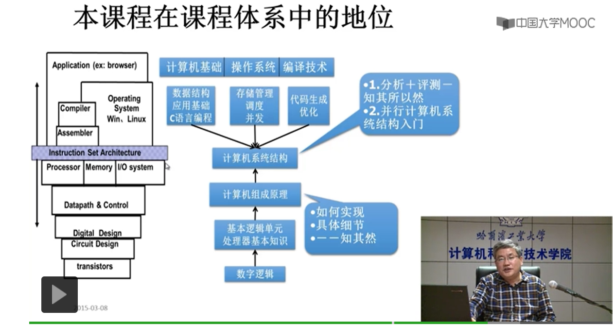

## 计算机组成（组织）原理 ---- 中国学生慕课（账号：18846077585） --- 哈工大课程

#### 1.内容

- ##### 基本部件的结构和组织方式

- ##### 基本运算的操作原理

- ##### 基本部件和单元的设计思想

#### 2.特色

- ##### 计算机组成的一般原理，不以具体机型为依托

- ##### 采用自顶向下的方式，层层细化

#### 3.教材

- ##### 授课教材： 唐朔飞教授. 计算机组成原理（第2版）. 高等教育出版社   相对于的配套教材：计算机组成原理-学习指导与习题解答（第2版）

  

  ---

- ##### 参考教材：数字设计和计算机体系结构

#### 4.本课程在课程体系中的地位

### 第1章  计算机系统概论

- #####  1.1 计算机系统简介

- ##### 1.2 计算机的基本组成

- ##### 1.3 计算机硬件的主要技术指标

#### 1.1 计算机系统简介

- ##### 现代计算机的多态性

- ##### 计算机的系统：分为硬件和软件。系统软件利用硬件提供的接口完成自己的功能，应用软件利用系统软件提供的接口调用系统软件的功能实现自己的功能。

  - ###### 1.硬件：计算机的实体，eg：主机，外设等

  - ###### 2.软件：由具有各类特殊功能的信息（程序）组成，分为==系统软件==和==应用软件==
  
    - 系统软件：用来管理整个计算机系统
    	
      ​	①语言处理程序：用来将高级语言编译成计算机系统可识别的机器语言（机器语言由0和1构成）
      
      ​	②操作系统：管理计算机系统的软硬件资源，提供人机交互，实现多个用户多个程序可以协调的在一台计算机上执行
      
      ​	③服务型程序：如tianhe-2这种处理大规模复杂程序的计算机
      
      ​	④数据库管理系统
      
      ​	⑤网络软件
    - 应用软件：按任务需要编制成的各种程序，如电脑游戏魔兽、cs等
    
      
  
- ##### 计算机系统的层次结构
  
  - ###### 应对系统复杂性管理的方法1：抽象（可根据物理抽象分为`9`层，根据程序员抽象分为`5`层）
  
    - 抽象：隐藏系统当中不重要的细节叫做抽象 ---- David Harris。
  
    - 根据程序员抽象分成（编译步骤由⑤~①）：①②是由硬件实现，③④⑤是由软件实现
  
  ​                                      ①微指令系统（微程序机器M0），由硬件直接执行微指令
  
  ​                                      ②机器语言（实际机器M1），用微指令解释机器指令
  
  ​                                      ③操作系统（虚拟机器M2），用机器语言解释操作系统
  
  ​                                      ④汇编语言（虚拟机器M3），用汇编程序翻译成机器语言程序
  
  ​                                      ⑤高级语言（虚拟机器M4，如果高级语言想要正确执行，需要为其提供编译程序或解				释程序），用编译程序翻译成汇编语言程序
  
   - 计算机体系结构：机器语言程序员所见到的计算机系统的属性概念性的结构与功能特性。主演研究具体指令的实现，如有无乘法指令（指令系统、数据类型、寻址技术、I/O机理）
    - 计算机组成：实现计算机体系结构所体现的属性。主要研究如何实现相关指令，如实现乘法指令（具体指令的实现）

#### 1.2 计算机的基本组成

- ##### 冯.诺依曼计算机：匈牙利科学家冯.诺依曼（`现代计算机之父`）提出程序存储思想，并将这一思想运用在计算机设计当中，把根据这个原理的计算机称为冯.诺依曼计算机。
  
  - 特点：
    1. 由五大部件组成
    2. 指令和数据以同等地位存于存储器，可按地址寻访
    3. 指令和数据用二进制表示
    4. 指令由数据码和地址码组成
    5. ==存储程序（核心特征）==
    6. 以运算器为中心

- ##### 冯.诺依曼计算机硬件框图

  - ###### 缺点：以运算器为核心，导致运算器负荷较大，框图结构乱，不具有层次化

  

  > ###### 运算器（ALU）：算术运算，逻辑运算
  >
  > ###### 控制器（CU）： 指挥程序（指令）运行，完成指令的执行和完成指令之间先后顺序的控制
  >
  > ###### 存储器：存放数据和程序（指令）
  >
  > ###### 输入设备：将我们认识的信息转化成机器能识别的形式
  >
  > ###### 输出设备：将计算机处理的结果转化成人们所认识的信息
  >
  > > `ALU和CU共同构成了CPU`
  > 
  > 
  > 
  根据缺点进行改进：改进一： 改为以存储器为中心的计算机硬件框图（依旧有点乱）
  >
  > 
  >
  > ---
  >
  > ​							     改进二： 
  >
  > 
  >
  > ###### 应对系统复杂性管理的方法2（3’Y）：
  > 
  > > 1. 层次化（Hierachy）：将被设计的系统划分为多个模块或子模块
  > >2. 模块化（modularity）：有明确定义（well-defined）的功能和接口
  > > 3. 规则性（regularity）：模块更容易被重用

- ##### 问题：

  1. ###### 一个现时中的问题，如何用计算机来解决？
  
  2. ###### 是不是所有的问题都可以用计算的方法来解决？（可以查阅一下可计算理论）
  
  
  
  - ##### 用计算机解决问题的步骤
  
    1. ###### 上机前的准备
  
       - 建立数学模型    如：$u = U_mSin\omega t$
  
       - 确定计算方法      
  
          
  
       - 编制解题程序
  
         - 程序 —— 运算的 ==全部步骤==
         - 指令 —— ==每一个步骤==
  
  - ##### 编程举例
  
     	计算     $ax^2+bx+c$                                                          =                                     $ (ax+b)x+c$
  
    ​	 步骤： 1. 取$x$ 至运算器中  —— $x$																	   1. 取$x$ 至运算器中
  
     				 2. 乘以$x$ 在运算器中  —— $x^2$																 2. 乘以$a$ 在运算器中
  
    ​				  3. 乘以$a$ 在运算器中  —— $ax^2$                                                               3. 加$b$ 在运算器中
  
    ​				  4. 存$ax^2$ 在存储器中  —— 存 $ax^2$                                                          4. 乘以$x$ 在运算器中
  
    ​				  5. 取$b$ 至运算器中  —— $b$													                     5. 加$c$ 在运算器中
  
    ​				  6. 乘以$x$ 在运算器中  —— $bx$
  
    ​				  7. 加$ax^2$ 在运算器中  —— $ax^2+bx$
  
    ​				  8. 加$c$ 在运算器中  —— $ax^2+bx+c$
  
  - ##### 指令格式举例
  
    
  
    ==`每一条指令都是二进制表示`==
  
    上图中    `ACC：寄存器`
  
    ​				`[]：表示保存的内容，如[ACC]表示寄存器保存的内容，[α]表示内存单元α保存的内容`
  
    ​				`α、β、γ等：表示内存单元α、β、γ` 
  
    
  
    ​        计算 $ax^2+bx+c$	程序清单：
  
    ​	                                                 			
  
  
  
  - ##### 存储器的基本组成
  
      
  
      - ##### 存储元件（0/1）  —^构成^—>  存储单元  —^构成^—>  存储体
  
        - ==存储单元==：存放一串二进制代码
  
        - ==存储字==：存储单元中二进制代码的组合
        - ==存储字长==：存储单元中二进制代码的位数
  
      - ##### 每个存储单元赋予一个地址，存储单元的寻访就是按照地址来寻访。
  
      - ##### ==MAR==：存储器地址寄存器（保存存储单元的地址或编号~以二进制形式保存~，反映存储单元的个数）
  
      - ##### ==MDR==：存储器数据寄存器（反映存储字长）
  
      
  
  - ##### 运算器的基本组成及操作过程
  
      
  
  

---

1.2计算机基本组成第五节 10：53

